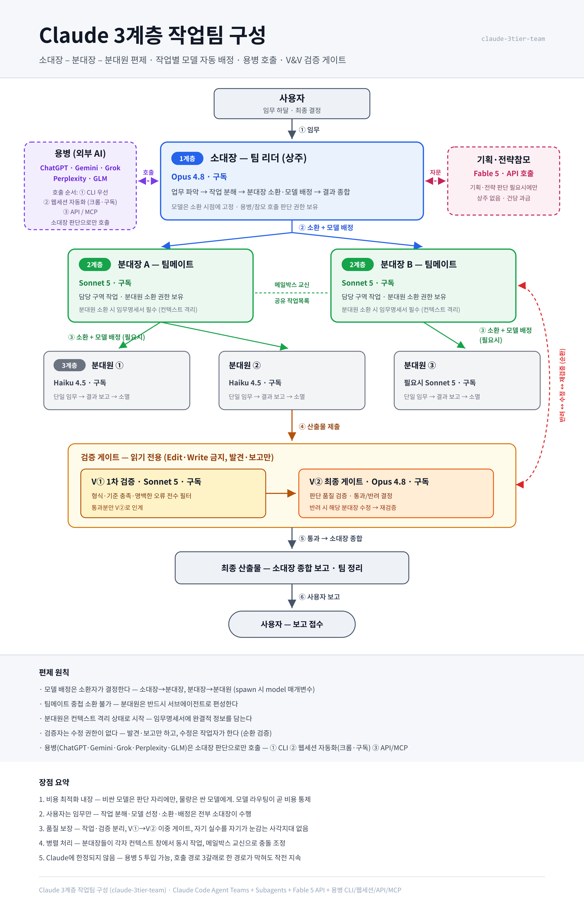

# Claude Code · Codex 3계층 작업팀 구성법 (claude-codex-3tier-team)

Claude Code Agent Teams 위에 **소대장–분대장–분대원 3계층 군대식 편제**를 구성하는 스킬입니다. 임무를 내리면 소대장이 작업을 분해하고, 계층별로 적합한 모델을 배정해 병렬 수행하며, 이중 검증 게이트를 통과한 산출물만 보고합니다.

**2계층과 최종 검증 게이트에 Codex CLI가 들어갑니다.** 외부 AI를 "부르면 답만 주고 빠지는 용병"이 아니라 **담당 구역을 지고 검증을 받는 부대원**으로 편성합니다.



## 편제

| 계층 | 직책 | 실체 | 모델 | 과금 |
|---|---|---|---|---|
| — | 사용자 | — | — | — |
| 1계층 | 소대장 (팀 리더, 상주) | 현재 세션 | Opus 5 | 구독 |
| 2계층 | 분대장 (팀메이트) | Agent Teams | Sonnet 5 | 구독 |
| 2계층 | **파견 분대장** | **Codex CLI (외부·비상주)** | Codex 최고 사양 | **ChatGPT 구독** |
| 3계층 | 분대원 (서브에이전트) | Subagent | Haiku 4.5 (필요시 Sonnet 5) | 구독 |
| 특수 | 검증담당 V① (읽기 전용) | 팀메이트 | Sonnet 5 | 구독 |
| 특수 | **검증담당 V② (최종 게이트, 읽기 전용)** | **Codex CLI** | Codex 최고 사양 · effort `medium` | **ChatGPT 구독** |
| 특수 | 기획·전략참모 (비상주) | 스크립트 호출 | Fable 5 | API 건당 |
| 특수 | 용병 (외부 AI 4종) | Gemini·Grok·Perplexity·GLM | — | CLI → 웹세션 → API 폴백 |

### 핵심 원칙

- **모델 배정은 소환자가 결정한다** (소대장→분대장, 분대장→분대원). 소환 시점에 고정되며 사후 변경 불가
- **검증자는 수정 권한이 없다** — 발견·보고만 하고, 수정은 작업자가 하며, 수정본은 V①부터 재검증
- **V① 전수 검증 → V② 최종 게이트**를 통과해야 사용자에게 보고
- **비싼 모델은 판단 자리에만, 물량은 싼 모델에게** — 모델 라우팅이 곧 비용 통제

### 왜 V②가 Codex인가

최종 게이트는 가장 비싼 자리였습니다. 여기를 다른 구독으로 옮기면 비용이 분산됩니다. 그런데 이유가 비용만은 아닙니다.

**V②의 임무는 "V①이 못 본 사각을 다른 눈으로 보는 것"입니다.** Codex는 세션 맥락을 전혀 공유하지 않아 **처음 보는 사람에 가깝습니다.** "처음 보는 사용자가 이 화면에서 혼동하지 않는가" 같은 판정에는 맥락을 모르는 쪽이 오히려 정확합니다. 게다가 다른 LLM 가족이라 자기검증 편향에서도 벗어납니다.

실측(2026-08-02): Codex CLI가 PNG 화면 캡처를 판독하고, 3단 레이아웃·색·한글 구획명까지 정확히 읽었습니다.

## 설치

```
📁 ~/.claude/skills/claude-codex-3tier-team/
📄 SKILL.md            ← SKILL.md 복사
📁 scripts/            ← scripts/call-fable5.py 복사

📁 ~/.claude/agents/
📄 claude-codex-3tier-squad-leader.md   ← agents/ 3개 파일 복사
📄 claude-codex-3tier-verifier-v1.md
📄 claude-codex-3tier-verifier-v2.md
```

요구 사항:
- Claude Code v2.1.178+ (권장 v2.1.201+)
- Agent Teams 활성화: settings.json에 `{ "env": { "CLAUDE_CODE_EXPERIMENTAL_AGENT_TEAMS": "1" } }`
- **Codex CLI** (파견 분대장·V②용): `npm i -g @openai/codex` + `codex login` (ChatGPT 구독 경로). 없으면 편제에서 빼고 Claude 분대장·Opus V②로 대체됩니다
- 전략참모(선택): 환경변수 `ANTHROPIC_API_KEY` (API 건당 과금)

## 사용

새 세션에서:

```
3계층 작업팀으로 ○○○ 해줘
```

소대장(세션)이 업무를 파악해 분대장들을 팀메이트로 소환하고, 검증 게이트까지 자동으로 운용합니다.

## Codex 호출 규격 (위반하면 그 자리에서 실패)

전부 실측으로 확인된 제약입니다. SKILL.md §4.5에 상세가 있습니다.

1. **git 저장소가 아닌 폴더** → `--skip-git-repo-check` 필수
2. **한글을 stdin·인자로 직접 전달** → 깨짐. 영문 프롬프트 + 한글은 UTF-8(BOM 없음) 파일로
3. **한글 경로에서 실행** → 오류. ASCII 경로로 복사해 넘긴다
4. **stdin 미종료** → 무한 대기. 파이프(`|`) + `-` 인자로 EOF
5. **종료 마커 없는 임무** → 성공·실패 판별 불가. `TASK_DONE:` / `TASK_BLOCKED:` 강제

모델은 **호출문에 박지 않고** `~/.codex/config.toml` 설정을 따릅니다(모델명 노후화 회피). 추론강도만 `-c model_reasoning_effort="medium"` 로 명시합니다.

## 저장소 구성

```
📄 SKILL.md              — 스킬 본체 (편제·원칙·모델 라우팅·운용 절차·Codex 호출 규격·용병 매핑)
📁 agents/               — 분대장·검증담당 역할 파일 (model·tools frontmatter)
📁 scripts/              — call-fable5.py (Fable 5 전략참모 API 호출)
📁 assets/               — 구조도 SVG/PNG
```

## 라이선스

MIT
