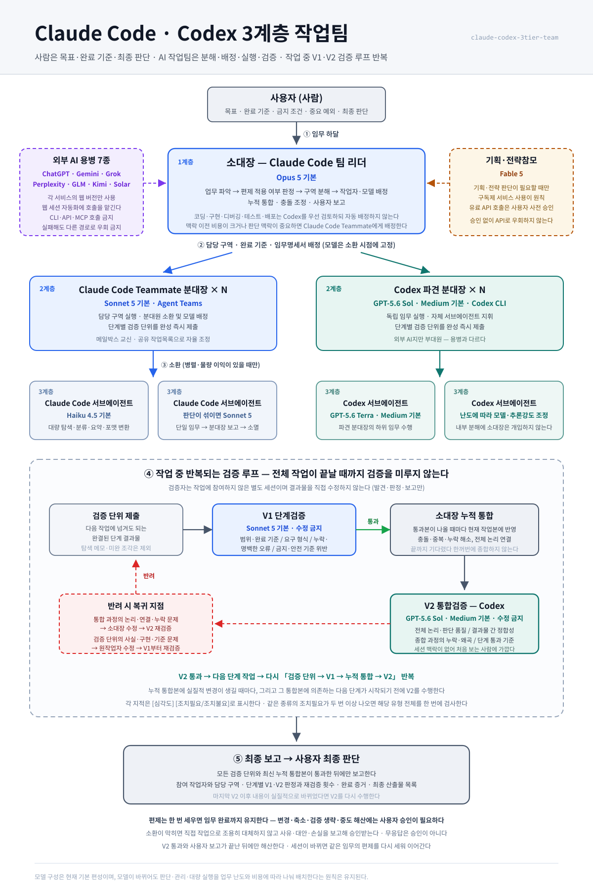

# Claude Code · Codex 3계층 작업팀 구성법 (claude-codex-3tier-team)

사람이 사용자(지휘)를 맡고 **Claude Code가 3계층 작업팀을 운영**하는 스킬입니다. 임무를 내리면 소대장이 작업을 분해하고, 계층별로 적합한 모델을 배정해 병렬 수행하며, **작업 중 반복되는 V1·V2 이중 검증 루프**를 통과한 산출물만 보고합니다.

**Codex는 2계층 파견 분대장과 작업 미참여 V2 통합검증자로 참여합니다.** 외부 AI를 "부르면 답만 주고 빠지는 용병"이 아니라 **담당 구역을 지고 검증을 받는 부대원**으로 편성합니다.

이것은 Claude Code와 Codex의 공식 통합 기능이 아니라, **스킬과 작업 규칙으로 두 환경을 연결한 운용 체계**입니다. 아래 모델 구성은 현재 기본 편성이며, 모델이 바뀌어도 판단·관리·대량 실행을 업무 난도와 비용에 따라 나눠 배치한다는 원칙은 유지됩니다.



## 무엇을 해결하나

AI가 늘어날수록 **사람의 작업자 선택·개별 지시·결과 통합·검증 업무까지 늘어납니다.** 이 편제는 사람에게 목표·완료 기준·중요 예외·최종 판단만 남기고, 분해·배정·실행·검증은 AI 작업팀이 맡습니다.

## 편제

| 직책 | 실체 | 기본 모델·방식 | 책임 |
|---|---|---|---|
| 사용자 | 사람 | — | 목표·완료 기준 설정, 편제 변경·중요 예외 승인, 최종 판단 |
| 소대장(1계층) | Claude Code 팀 리더 | Opus 5 기본 | 업무 파악, 분해, 배정, 종합, 보고 |
| Claude Code Teammate 분대장(2계층) | Agent Teams Teammate | Sonnet 5 기본 | 담당 구역 실행, 분대원 지휘, 단계별 검증 단위 제출 |
| Codex 파견 분대장(2계층) | Codex CLI | GPT-5.6 Sol·Medium 기본 | 독립 임무 실행, 자체 서브에이전트 지휘, 단계별 검증 단위 제출 |
| Claude Code 서브에이전트(3계층) | Subagent | Haiku 4.5 기본 | 범위가 분명한 단일 임무 수행 후 분대장에게 보고 |
| Codex 서브에이전트(3계층) | Codex 서브에이전트 | GPT-5.6 Terra·Medium 기본 | 파견 분대장의 하위 임무 수행 후 보고 |
| V1 단계검증자 | 작업 미참여 Teammate 별도 세션 | Sonnet 5 기본, 수정 금지 | 단계별 검증 단위 즉시 검증 |
| V2 통합검증자 | 작업 미참여 Codex 별도 세션 | GPT-5.6 Sol·Medium 기본, 수정 금지 | 누적 통합본 독립 검증 |
| 기획·전략참모 | Fable 5 | 구독제 원칙, 유료 API는 사전 승인 | 기획·전략 자문 |
| 외부 AI 용병 | 7종 웹 버전 | 웹 세션 자동화만 사용 | 외부 관점·전문 작업 |

분대장은 한 명으로 고정하지 않습니다. 독립 작업 구역과 작업량에 따라 **두 종류의 분대장을 각각 복수로** 편성합니다.

## 핵심 원칙

- **업무의 성격과 난도를 파악한 뒤** 작업자와 모델을 소환한다. 모델은 소환 시점에 고정되며, 바꾸려면 종료 후 재소환한다
- **작업자와 검증자를 분리한다.** 검증자는 결과물을 직접 수정하지 않는다
- **단계별 결과물이 생길 때마다 `V1 → 누적 통합 → V2`를 반복한다.** 전체 작업 종료까지 검증을 미루지 않는다
- **비싼 모델은 판단·종합에 집중한다.** 비용 통제의 목표는 총토큰 감소가 아니라 고급 모델을 단순 작업에 쓰는 낭비를 줄이는 것이다
- **편제는 한 번 세우면 임무 완료까지 유지한다.** 변경·축소·검증 생략·중도 해산에는 사용자 승인이 필요하다

## 편제를 쓸 때 / 쓰지 않을 때

**쓴다** — 독립 작업 구역이 둘 이상, 병렬 시간 이익이 큼, 긴 산출물·복수 모듈을 하나로 종합, 오류 시 재작업 비용이 큼, 서로 다른 관점의 독립 검증이 필요.

**쓰지 않는다** — 파일 1~2개의 기계적 수정, 순차 의존 작업, 여러 작업자가 같은 파일에 몰려야 하는 작업, 산출물이 남지 않는 조회, 대화 그 자체.

## 왜 V2가 Codex인가

V2의 임무는 **"V1이 못 본 사각을 다른 눈으로 보는 것"** 입니다. Codex는 세션 맥락을 전혀 공유하지 않아 **처음 보는 사람에 가깝습니다.** "처음 보는 사용자가 이 화면에서 혼동하지 않는가" 같은 판정에는 맥락을 모르는 쪽이 오히려 정확합니다. 다른 LLM 가족이라 자기검증 편향에서도 벗어나고, 가장 비싼 자리였던 최종 게이트의 비용이 다른 구독으로 분산됩니다.

**V2는 마지막 한 번만 하는 최종검증이 아닙니다.** 누적 통합본에 실질적인 변경이 생길 때마다, 그리고 그 통합본에 의존하는 다음 단계가 시작되기 전에 수행합니다.

## 설치

```
📁 ~/.claude/skills/claude-codex-3tier-team/
📄 SKILL.md                      ← SKILL.md 복사
📁 references/
📄 codex-windows.md              ← references/ 복사 (Windows에서 Codex 호출 시)
📁 scripts/
📄 call-fable5.py                ← scripts/ 복사 (선택)

📁 ~/.claude/agents/
📄 claude-codex-3tier-squad-leader.md   ← agents/ 2개 파일 복사
📄 claude-codex-3tier-verifier-v1.md
```

요구 사항:
- Claude Code v2.1.178+ (권장 v2.1.201+)
- Agent Teams 활성화: `settings.json` 에 `{ "env": { "CLAUDE_CODE_EXPERIMENTAL_AGENT_TEAMS": "1" } }`
- **Codex CLI** (파견 분대장·V2용): `npm i -g @openai/codex` + `codex login` (ChatGPT 구독 경로). 없으면 편제에서 빼고 Claude Code Teammate 분대장으로 대체한 뒤 사용자에게 보고합니다
- 전략참모(선택): Fable 5는 구독제 사용이 원칙이며, API 사용료가 발생하는 호출(`scripts/call-fable5.py`, 환경변수 `ANTHROPIC_API_KEY`)은 **사용자의 사전 승인**을 받은 경우에만 씁니다

## 사용

새 세션에서:

```
3계층 작업팀으로 ○○○ 해줘
```

소대장(세션)이 업무를 파악해 분대장을 소환하고, 검증 루프까지 자동으로 운용합니다.

## 외부 AI 용병 7종

ChatGPT, Gemini, Grok, Perplexity, GLM, Kimi, Solar.

- **각 서비스의 웹 버전만** 사용하고, 호출은 웹 세션 자동화에 맡깁니다
- CLI·API·MCP·SDK·직접 HTTP 요청으로 호출하지 않습니다
- 로그인 만료·캡차·사용량 제한·사이트 장애로 실패해도 **다른 경로로 우회하지 않고** 사용자에게 보고해 결정을 받습니다
- 기존 로그인 계정과 구독·무료 이용 범위만 씁니다. 추가 결제·요금제 변경은 사용자 승인 사항입니다

> 웹 세션 자동화가 없다면, 해당 용병은 편제에서 빼고 진행하거나 사람이 직접 웹에서 질의해 결과를 소대장에게 전달하는 수동 절차로 대체합니다.

## Codex CLI 호출 (Windows)

실측으로 확인된 제약이 있습니다. 상세는 [references/codex-windows.md](references/codex-windows.md).

1. **git 저장소가 아닌 폴더** → `--skip-git-repo-check` 필수
2. **한글을 stdin·인자로 직접 전달** → 깨짐. 영문 프롬프트 + 한글은 파일로
3. **한글 경로에서 실행** → 오류. ASCII 경로로 복사해 넘긴다
4. **stdin 미종료** → 무한 대기. 파이프(`|`) + `-` 인자로 EOF
5. **종료 마커 없는 임무** → 성공·실패 판별 불가. `TASK_DONE:` / `TASK_BLOCKED:` 강제

임무명세서 인코딩은 **경로에 따라 정반대**입니다 — stdin 파이프는 UTF-8 BOM 없이, Codex가 파일을 직접 읽는 경우는 UTF-8 BOM 필수(PowerShell 5.1이 BOM 없는 UTF-8을 ANSI로 오독). 자세한 내용과 사고 사례는 references 문서에 있습니다.

## 저장소 구성

```
📄 SKILL.md              — 스킬 본체 (편제·원칙·모델 배정·운용 절차·검증 판정)
📁 references/           — codex-windows.md (Windows Codex CLI 호출 규격)
📁 agents/               — 분대장·V1 단계검증자 역할 파일 (model·tools frontmatter)
📁 scripts/              — call-fable5.py (Fable 5 API 호출 — 사전 승인 필요)
📁 assets/               — 구조도 (claude-codex-3tier-team-diagram.svg / .png)
```

## 라이선스

MIT
